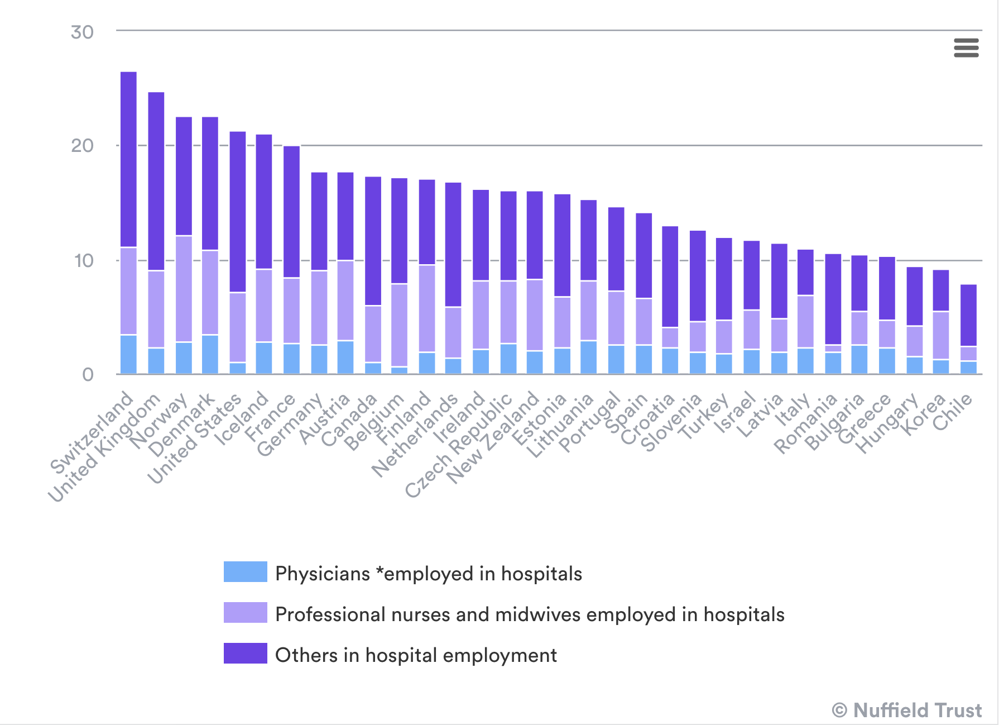
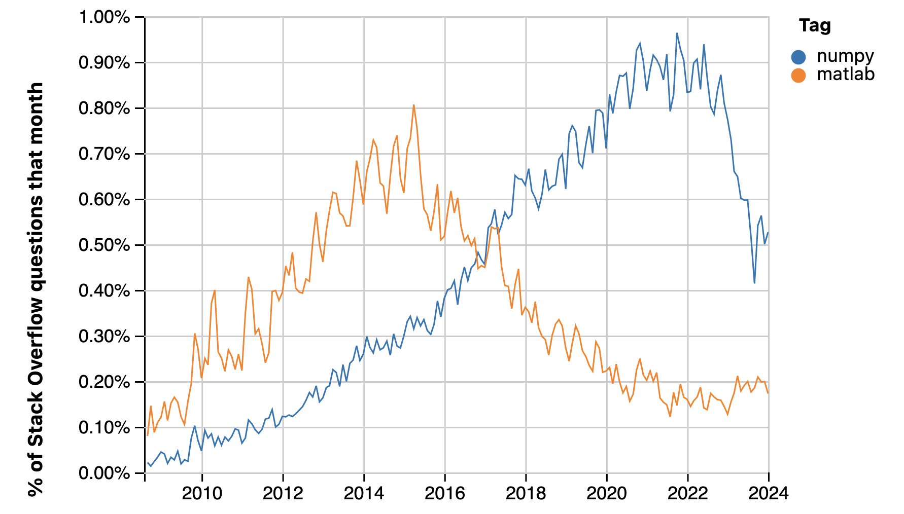
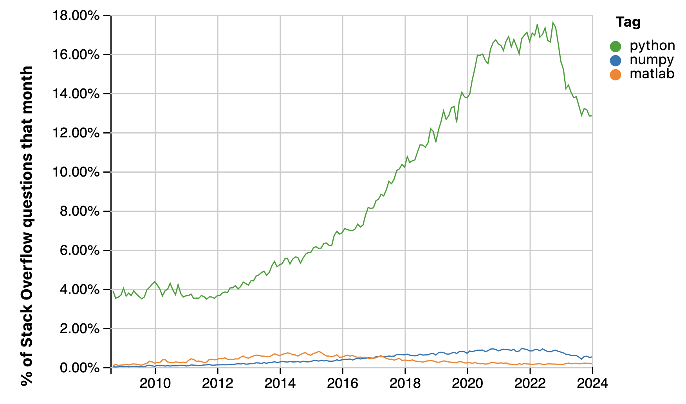

---
# YAML metadata
title: "Bureaucracy, consulting, and reforming the NHS"
author: "Matthew Brett"
linkcolor: blue
urlcolor: blue
bibliography: data-science-bib/data_science.bib
<#ifndef HANDOUT>
suppress-bibliography: true
<#endif>
---

# Bureaucracy

[La muerte de un
burócrata (1966)](https://en.wikipedia.org/wiki/La_muerte_de_un_bur%C3%B3crata)

# The plan

* Bureaucracy is:
    * Pervasive
    * Incompetent
    * Expensive
    * Grows relentlessly
* Bureaucracy has a series of defensive maneuvers, including consulting.
* The NHS is on the point of collapse under the weight of its bureaucracy.
* Reform must come from agile competition from outside.

# How does it grow?

> ... picture a civil servant, called A, who
finds himself overworked. Whether this overwork is real or imaginary
is immaterial, but we should observe, in passing, that A's sensation
(or illusion) might easily result from his own decreasing energy: a
normal symptom of middle age. For this real or imagined overwork there
are, broadly speaking, three possible remedies. He may resign; he may
ask to halve the work with a colleague called B; he may demand the
assistance of two subordinates, to be called C and D. There is
probably no instance in history, however, of A choosing any but the
third alternative.

[Parkinson's law](https://asterisk.dynevor.org/parkinsons-law.html)

# Why is it incompetent?

{height=60%}

Summary: What one programmer can do in one month, two programmers can do in
two months.

[The Mythical Man
Month](https://en.wikipedia.org/wiki/The_Mythical_Man-Month)

# Why is it incompetent?

> .. in any bureaucratic organization there will be two kinds of people":
>
> First, there will be those who are devoted to the goals of the
organization. Examples are dedicated classroom teachers in an educational
bureaucracy, many of the engineers and launch technicians and scientists at
NASA, even some agricultural scientists and advisors in the former Soviet
Union collective farming administration.
>
> Secondly, there will be those dedicated to the organization itself.
Examples are many of the administrators in the education system, many
professors of education, many teachers union officials, much of the NASA
headquarters staff, etc.
>
> The Iron Law states that in every case the second group will gain and keep
control of the organization. It will write the rules, and control promotions
within the organization.

[Pournelle's Iron
Law](https://www.jerrypournelle.com/reports/jerryp/iron.html)

# Methods of defense

* Setting and marking own homework.
* Controlling data for assessment.
* Strategic initiatives.
* Appeals to authority (Don't worry your pretty little heads about it).
* Quality assurance (It's not our fault, we made everyone get certificates)
* Consulting.

# Consulting

[Despair.com Consulting](https://despair.com/products/consulting)

# Example 1 : the M16 rife

{height=40%}

> American weapons designers concluded that an intermediate round was
necessary, and recommended a small-caliber, high-velocity cartridge.
>
> However, senior American commanders, having faced fanatical enemies ...
insisted that a single, powerful .30 caliber cartridge be developed

[M16 rifle](https://en.wikipedia.org/wiki/M16_rifle) (see page for image
license).

# Example 2 : the NHS Covid tracking app

* Matt Hancock forms [NHSX](https://en.wikipedia.org/wiki/NHSX) in [February
  2019](https://www.gov.uk/government/news/nhsx-new-joint-organisation-for-digital-data-and-technology)
  to "take forward digital transformation in the NHS.".
* March 2020 - working on a Covid tracing app.
* Three serious problems:
    * [Privacy](https://drive.google.com/file/d/1uB4LcQHMVP-oLzIIHA9SjKj1uMd3erGu/view)
    * Bluetooth detection failing on iPhones.
    * Symptoms only (no way to enter test).
* Roll-out on Isle of Wight in May.  Detected 4% of iPhones.
* Abandoned on 18 June 2020.

[Why the NHS Covid-19 contact tracing app
failed](https://www.wired.co.uk/article/nhs-tracing-app-scrapped-apple-google-uk)

# The NHS leads the world ...

[NHS staff in numbers](https://www.nuffieldtrust.org.uk/resource/the-nhs-workforce-in-numbers)

# The NHS on its own bureaucracy

> ... around a third of a community-based clinician's time (or 88 days per
working year) is estimated to be spent on administration and patient
coordination. ...
> ...
> That health and care staff are often time poor, with bureaucratic burdens
taking up too much of their time, is also what we heard from our engagement
across the system.

[Busting bureaucracy: empowering frontline staff by reducing excess
bureaucracy in the health and care system in
England](https://www.gov.uk/government/calls-for-evidence/reducing-bureaucracy-in-the-health-and-social-care-system-call-for-evidence/outcome/busting-bureaucracy-empowering-frontline-staff-by-reducing-excess-bureaucracy-in-the-health-and-care-system-in-england)

# The NHS solution

> NHSX will launch and then implement a Data Strategy for Health and Social Care in the coming months. (ibid).

# Around bureaucracy example 1 - Pentagon and F16

{height=60%}

(From the John R. Boyd Collection (COLL/2062) at the Marine Corps History
Division).

[John Boyd](https://en.wikipedia.org/wiki/John_Boyd_(military_strategist))

# The F16

# After the F16

> ... the reason I left [the Pentagon] was it became impossible to design
airplanes or tanks or ships that were better than their predecessor and cost
less. Because the nature of this enormously corrupt military industrial
complex procurement process, is corrupt all the way to the base.

[Pierre Sprey](https://asterisk.dynevor.org/corrupt-all-the-way-down.html)

# Success with bureaucracy example 1 - Matlab and Numpy

# A nod to AI

# Lessons

* The design has to come from the practitioners.
* There needs to be tight-knit, completely committed group.
* It is most unlikely this will result in proportionate rewards in money or
  status.

# Proposal

* The NHS information systems are completely broken.
* They cannot be fixed from within the NHS bureaucracy.
* Form a group of builder-practitioners.
* Work outside the NHS initially.
* Make everything open-source.
* Plan to out-compete in-house solutions rapidly.
* Who will do this work?
* Who will pay for it?

# The end

Materials at <https://github.com/matthew-brett/bureaucracy-nhs-reform>

<#ifdef HANDOUT>
# References
<#endif>
